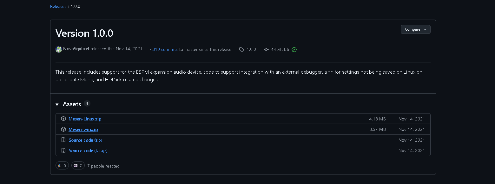
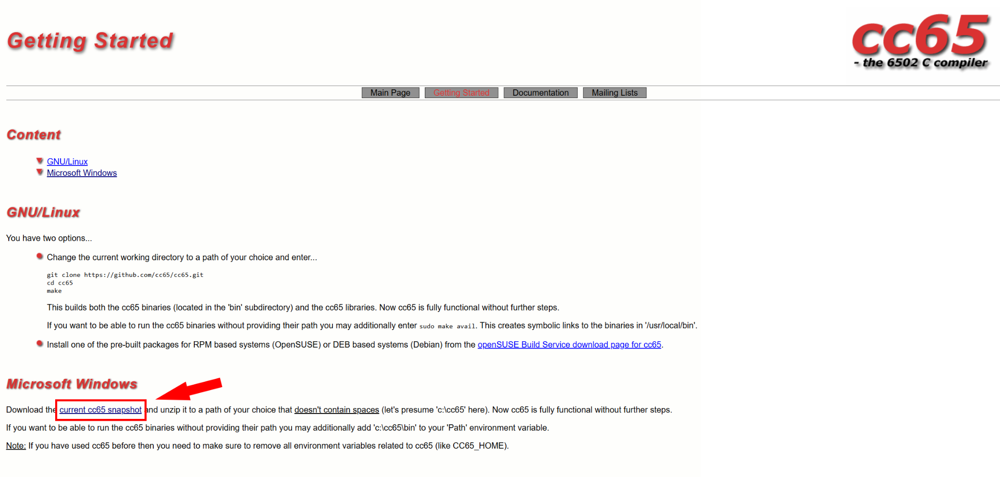
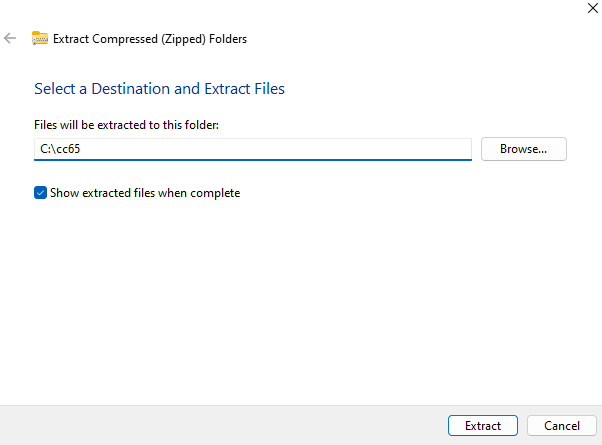

# Retro Console Programming Visual Studio Code Template
## Required Dependencies
- Visual Studio Code ([link](https://code.visualstudio.com/download))
- Mesen-X ([link](https://github.com/NovaSquirrel/Mesen-X/releases/tag/1.0.0))
- cc65 ([link](https://cc65.github.io/))

### Installing [Mesen-X](https://github.com/NovaSquirrel/Mesen-X/releases/tag/1.0.0)
We will download version 1.0.0 of Mesen-X. Mesen-X is a fork of the popular Mesen emulator with support for the debug files generated by cc65.

### Installing [cc65](https://cc65.github.io/)
#### Downloading

#### Extracting (Windows only)
We will extract the cc65 files to "C:/cc65".

## Configuring Visual Studio Code
- Open the project in VsCode
- Install the "Alchemy65" plugin ([link](https://marketplace.visualstudio.com/items?itemName=alchemic-raker.alchemy65))
- Change Mesen-X path in ".vscode/launch.json"
- Change cc65 paths in ".vscode/tasks.json"
- Reboot Visual Studio Code (some config only gets applied after a reboot)

### Linux
Downloading the Linux version of Mesen-X from Github will still provide you with an .exe file. Thus, Mono (or any other Windows compatibility layer that includes dotnet runtime) is required.

There is a sh file present in the repo (luanch-mesen.sh). In order to be capable of launching Mesen-X you need to modify the path of Mesen in that shell script. And put the shell script as the Mesen-X path in ".vscode/launch.json" using `${workspaceFolder}/launch-mesen.sh`.

## Running the project
- Go to 'Run and Debug'
- Place a breakpoint anywhere
- Run the project
- The emulator should now start and break on the set breakpoint

## Alchemy65 configuration
Alchemy65 has some more configuration options in ".vscode/launch.json"
- stopOnEntry: Set a breakpoint on the first insruction of the program
- resetOnEntry: Reset the emulator when restarting the debugger

# Credits
Credit to NES Hacker, whoms guide whe extended and who also wrote the example NES code.
[Github reposiory](https://github.com/NesHacker/DevEnvironmentDemo)
